# ENADE ADS 2021

## Sistema de simulado do ENADE ADS 2021.

Foi desenvolvido um projeto chamado SimuNade, com 5 contribuientes, sendo: Diogo Gabardo Soares, Eric Vieira de Carvalho, Paulo Felipe Silva Simão, Raul Mascarenhas Souza e Tony Bryan Espinoza Gutierrez, você pode acompanhar alguns dos contribuidores do projeto acessando a página de [contribuidores](https://github.com/ericcarvlh/eq8-enade-ads-2021-oficial/graphs/contributors) no *Github*. O projeto teve a orientação da Rita de Cassia Felix e coorientação do Jose Luis Barboza Lobianco, ambos docentes na Fatec Carapicuiba.

Caso você queira acessar o repositório do projeto no projeto, basta clicar [aqui](https://github.com/ericcarvlh/eq8-enade-ads-2021-oficial).

## Padrão de nomenclatura adotado:

Em relação as perguntas:

`Q1AE_EQ8` -> onde "Q" significa questão, "1" do número da questão, "A" de alternativa, "E" de alternativa correta e, "EQ8" significa Equipe 8.

Em relação as imagens:

`Q2AC_ENADE_ADS_2021_EQ8.png` -> onde "Q" significa questão, "2" o número da questão, "A" de alternativa, "C" de alternativa correta, "ADS" Análise e Desenvolvimento de Sistemas e, "EQ8" significaa Equipe 8.

Em relação as imagens das alternativas:

`Q10_alt_A` -> onde "Q" significa questão, "10" o número da questão, "alt" de alternativa e, "A" da pergunta em questão.

## Páginas

Confira a seguir uma breve informação sobre cada página do site.

### Início

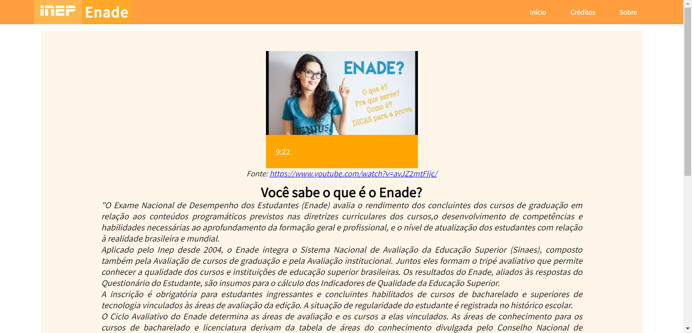

Página que contém algumas informações sobre o que é o ENADE,
acesso ao gabarito no próprio site do INEP e prova e, início do simulado.

### Creditos

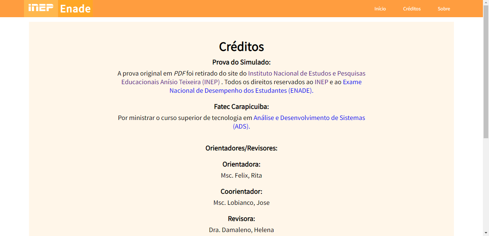

Página onde contém créditos, com informações técnicas e as principais referêencias.

### Sobre

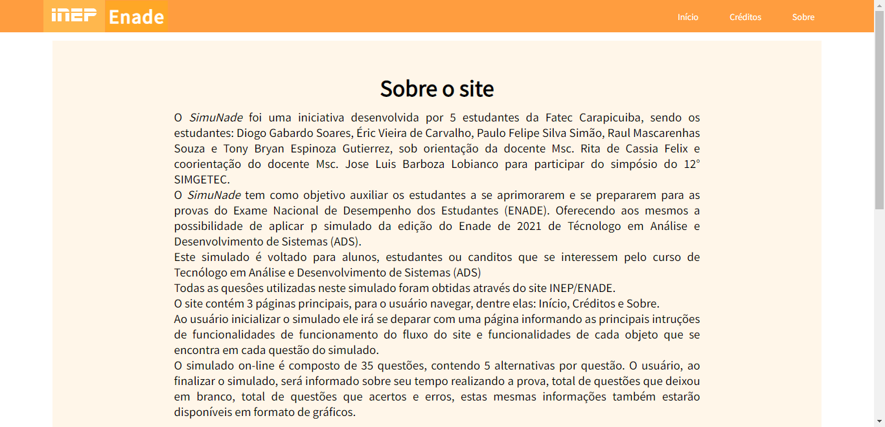

Local onde vai informar um pouco mais acerca do projeto e do site em si.

### Instruções

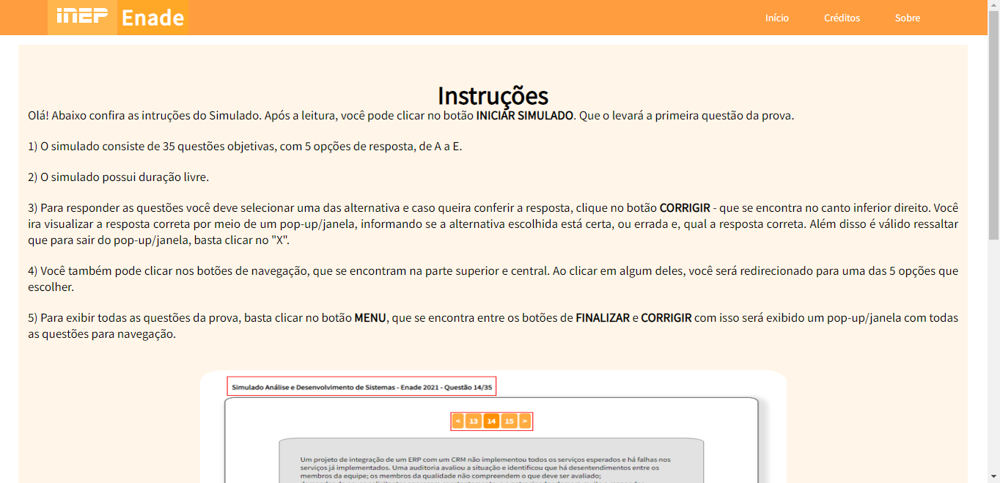

Ambiente onde o usuário irá ser informado sobre as funcionalidades ao iniciar o simulado.

### Questões

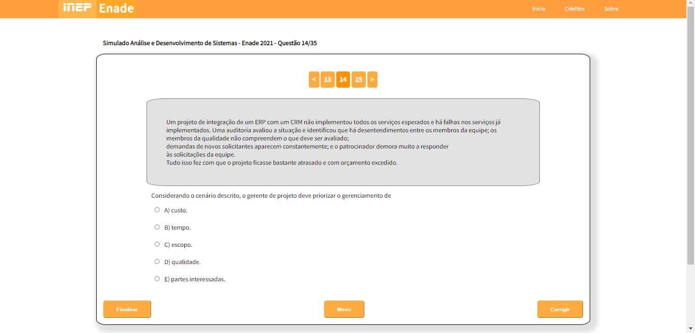

Basicamente todas as questões vão possuír a estrutura do exemplo acima.

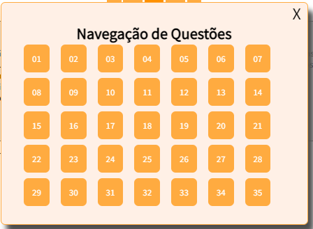

Pop-up que vai ser aberto quando o usuário clicar no botão de **menu**, serve para navegar por todas as questões do simulado.

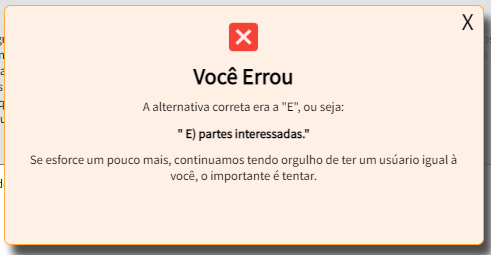

Pop-up que vai ser aberto quando o usuário clicar no botão de **corrigir** caso a resposta esteja incorreta.

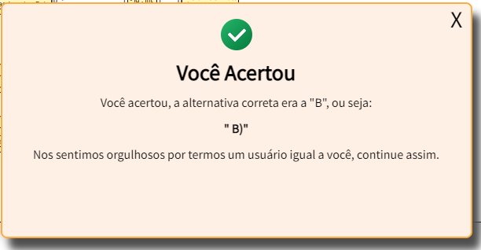

Pop-up que vai ser aberto quando o usuário clicar no botão de **corrigir** caso a resposta esteja correta.

### Resultado

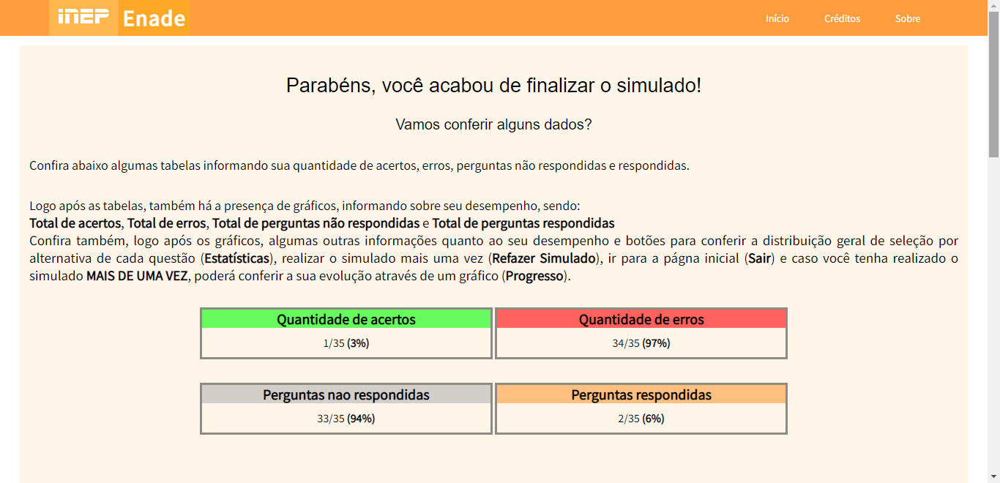

Ao finalizar a prova, o usuário irá se deparar com essa página

### Estatísticas gerais 

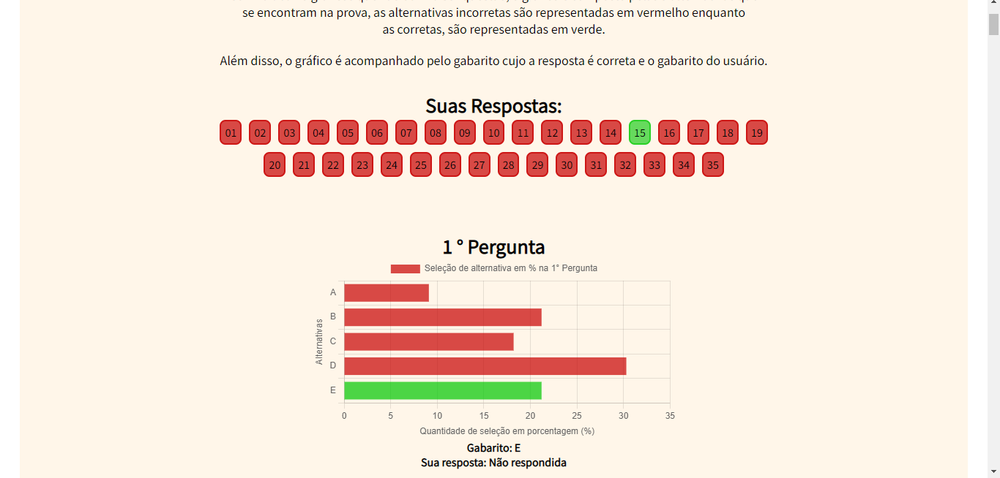

Página onde contém informações acerca das estatísticas de distribuição de seleção por alternativa da respectiva pergunta, além disso, a página contém o gabarito e o gabarito do usuário, mostrando se o usuário acertou ou errou. É válido ressaltar que os dados das estatísticas são fictícios, pois, no momento do projeto os dados ainda não tinham sido divulgados.

### Progresso

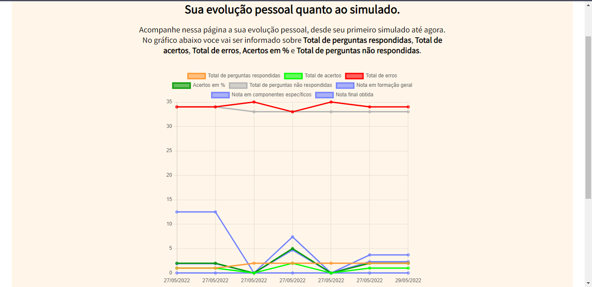

Página onde possuí a presença de um gráfico informando a evolução pessoal do usuário.

## Hospedagem do sistema

É válido ressaltar que com o *GitHub*, você consegue hospedar seu site de forma gratuita, você pode acessar esse sistema clicando [aqui](https://ericcarvlh.github.io/eq8-enade-ads-2021-oficial/Views/Principal/Index.html), onde irá se deparar com a página inicial.